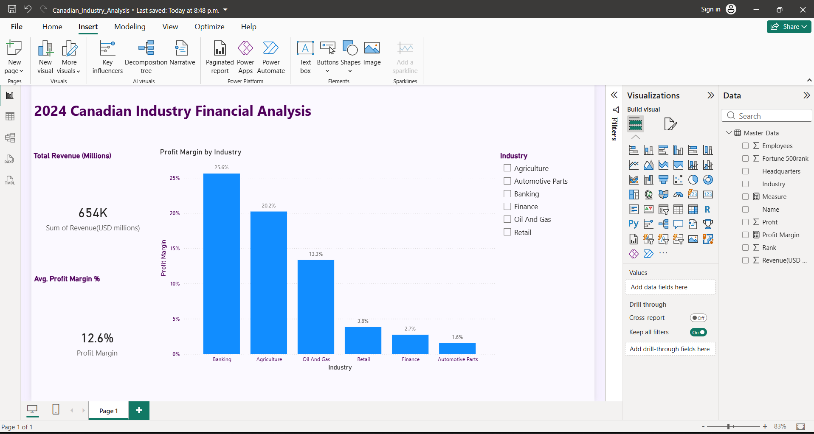

# 2024 Canadian Industry Financial Analysis (Power BI)

## Project Overview
An interactive dashboard built to analyze the financial health of Canada's top corporations across 6 major industries. This project demonstrates end-to-end data analysis: from ETL (Extract, Transform, Load) using Power Query to advanced DAX calculations and executive-level UI design.

## Dashboard Preview

## Key Technical Features
* **Data Transformation:** Used Power Query to clean and normalize raw data, handling mixed currency scales and industry categorization.
* **Dynamic DAX Measures:** Developed custom measures for **Profit Margin %** and **Total Revenue** to provide real-time insights.
* **Interactive UI:** Implemented a container-based layout with industry slicers and data labels for high scannability and professional presentation.

## How to View the Project
1. Download the `.pbix` file included in this repository.
2. Open using **Power BI Desktop**.
## The Development Process

### 1. Data Retrieval & Cleaning (The "Messy" Work)
* **The Problem:** Raw data from Wikipedia was inconsistent; some figures were in "Millions" while others were in "Thousands," causing visual distortions.
* **The Solution:** Used **Power Query** to normalize scales by creating conditional columns, ensuring all financial figures were converted to a single "Millions" standard.

### 2. Custom DAX Calculations (The "Analyst" Brain)
* **The Problem:** The raw dataset lacked a percentage-based margin, making it difficult to compare efficiency across industries of different sizes.
* **The Solution:** Engineered a custom DAX measure: 
  `Profit Margin = DIVIDE(SUM('Master_Data'[Profit]), SUM('Master_Data'[Revenue]))`
* **Impact:** This allows for dynamic, accurate comparisons regardless of which industry or company is selected.

### 3. UI/UX Design (The "Executive" Presentation)
* **The Problem:** Basic, unformatted charts can be overwhelming and lack a professional "corporate" feel.
* **The Solution:** * **Glass-morphism Container:** High-lighted high-level KPIs on a subtle left-hand panel for immediate impact.
  * **Direct Data Labels:** Enabled precise percentage labels on bar charts to eliminate guesswork.
  * **Interactive Slicers:** Converted standard lists into "Tile Buttons" for a modern, app-like user experience.
